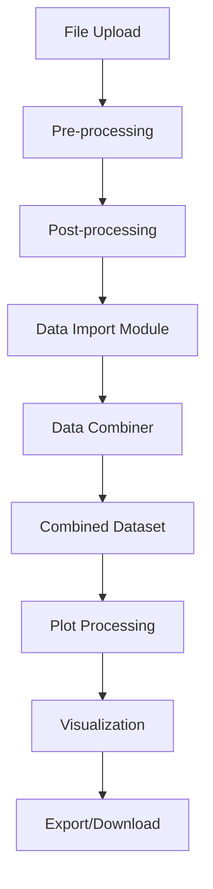

# Plotter App Architecture

## Overview

The Plotter App is built using a modular Shiny architecture that promotes code reusability, maintainability, and scalability. The application follows a clear separation of concerns with distinct modules for data import, processing, combination, and visualization.

## Core Architecture Principles

### 1. Modular Design
- **Separation of Concerns**: Each module handles a specific functionality
- **Reusability**: Modules can be instantiated multiple times (e.g., multiple importers)
- **Maintainability**: Changes to one module don't affect others
- **Testability**: Individual modules can be tested in isolation

### 2. Reactive Programming
- **Data Flow**: Reactive expressions ensure efficient data updates
- **Event-Driven**: User actions trigger appropriate reactive chains
- **Performance**: Debounced reactives prevent excessive computation
- **Consistency**: Automatic updates maintain data synchronization

### 3. Flexible Processing Pipeline
- **Multi-Stage Processing**: Data flows through distinct processing stages
- **Custom R Code**: User-editable R code at each stage
- **Error Handling**: Robust error catching and user feedback
- **Environment Isolation**: Safe execution contexts for user code

## Module Architecture

### Data Import Module (`server_data_import`)

**Purpose**: Handles file upload, validation, and initial processing

**Key Components**:
- File upload handling with format validation
- Pre-processing pipeline with custom R code execution
- Post-processing pipeline for data transformation
- Preview functionality for single files
- Batch processing for multiple files

**Reactive Structure**:
```
File Upload → File List → Filtered Files → Preview → Batch Processing → Combined Data
```

**Key Functions**:
- `pre_process_single_file()`: Handles individual file reading
- `post_process_single_df()`: Transforms data to standard format
- File filtering and validation
- Progress tracking for batch operations

### Data Combiner Module (`server_data_combiner`)

**Purpose**: Merges data from multiple import modules

**Key Components**:
- Reactive combination of multiple data sources
- Source tracking via `idcol` parameter
- Data validation and structure normalization
- Summary and sample data views

**Reactive Structure**:
```
Multiple Import Modules → Data Validation → rbindlist → Combined Dataset
```

**Key Features**:
- Automatic detection of valid data sources
- Handling of different column structures
- Memory-efficient data combination
- Real-time updates when source data changes

### Plotter Module (`server_plotter`)

**Purpose**: Creates individual plot instances with custom processing

**Key Components**:
- Plot-specific data processing
- Interactive plot configuration
- Multiple output formats (static/dynamic/text)
- Download functionality for individual plots

**Reactive Structure**:
```
Combined Data → Plot Processing → Plot Generation → Output Rendering
```

**Key Features**:
- Custom data filtering and sampling
- Flexible aesthetic mapping
- Faceting capabilities
- Time-based transformations
- Multiple plot types (ggplot2/plotly)

### Data Table Display Module (`server_data_table_display`)

**Purpose**: Provides interactive data viewing with custom R code

**Key Components**:
- Customizable data display logic
- Interactive DataTables integration
- Custom R code execution for table formatting
- Multiple display modes

**Reactive Structure**:
```
Input Data → Custom R Code → Processed Display → DataTable Rendering
```

## Data Flow Architecture

### Primary Data Pipeline



### Processing Stages

#### 1. Pre-processing Stage
- **Input**: Raw files from upload
- **Processing**: File reading, format detection, initial cleaning
- **Output**: Standardized data.table with basic structure
- **Customization**: User-editable R code for custom file handling

#### 2. Post-processing Stage
- **Input**: Pre-processed data.table
- **Processing**: Data transformation, melting, filtering, renaming
- **Output**: Long-format data with standard columns (timestamp, series, value)
- **Customization**: User-editable R code for data transformation

#### 3. Combination Stage
- **Input**: Multiple processed datasets from import modules
- **Processing**: Data validation, structure normalization, row binding
- **Output**: Single combined dataset with source tracking
- **Automatic**: No user customization required

#### 4. Plot Processing Stage
- **Input**: Combined dataset
- **Processing**: Plot-specific filtering, sampling, transformations
- **Output**: Plot-ready dataset
- **Customization**: Per-plot data processing code

#### 5. Visualization Stage
- **Input**: Plot-ready dataset
- **Processing**: Plot generation with aesthetic mapping
- **Output**: ggplot2 or plotly objects
- **Customization**: Full ggplot2/plotly code customization

## Component Interactions

### Module Communication

**Parent-Child Relationships**:
- Main server creates and manages child modules
- Modules return reactive expressions for parent consumption
- No direct inter-module communication (maintains loose coupling)

**Data Passing**:
- Reactive expressions pass data between modules
- Module outputs are reactive functions, not static values
- Automatic invalidation propagates changes through the pipeline

**Event Handling**:
- User interactions trigger module-specific observers
- Action buttons control processing workflow
- File uploads automatically trigger processing chains

### Dynamic Module Management

**Plotter Creation**:
- Dynamic UI insertion for new plotter tabs
- Reactive list management for active plotters
- Automatic cleanup of removed plotters

**Template System**:
- Serialization of all reactive inputs
- Custom handling for Ace Editor content
- Type-aware deserialization for input restoration

## Error Handling Strategy

### Defensive Programming
- **Input Validation**: All user inputs are validated before processing
- **Null Handling**: Comprehensive null checks throughout pipeline
- **Type Checking**: Data type validation at module boundaries

### Error Isolation
- **Try-Catch Blocks**: All user code execution wrapped in error handlers
- **Environment Isolation**: User code runs in sandboxed environments
- **Graceful Degradation**: Modules continue functioning when others fail

### User Feedback
- **Notification System**: Real-time feedback via `showNotification()`
- **Progress Tracking**: Visual progress bars for long operations
- **Error Messages**: Descriptive error messages with suggested actions

## Performance Considerations

### Reactive Optimization
- **Debounced Reactives**: Prevent excessive re-computation
- **Selective Invalidation**: Only invalidate necessary reactive chains
- **Caching**: Reactive values cache results until invalidated

### Memory Management
- **Data.table**: Efficient data manipulation with data.table
- **Copy-on-Write**: Minimize data copying where possible
- **Garbage Collection**: Automatic cleanup of unused objects

### Parallel Processing
- **Future Framework**: Parallel processing for file operations
- **Background Tasks**: Long operations don't block UI
- **Progress Reporting**: Real-time progress updates

## Security Considerations

### Code Execution Safety
- **Environment Isolation**: User code runs in separate environments
- **Function Exposure**: Only necessary functions exposed to user code
- **Error Catching**: Prevents code execution from crashing the app

### File Upload Security
- **File Type Validation**: Only allowed file types accepted
- **Size Limits**: Configurable file size restrictions
- **Path Sanitization**: Secure handling of file paths

## Extensibility

### Adding New Modules
1. Create module UI and server functions
2. Add to main UI structure
3. Wire reactive connections
4. Update documentation

### Supporting New File Formats
1. Extend pre-processing template
2. Add format detection logic
3. Test with sample files
4. Update documentation

### Custom Plot Types
1. Modify plotting template
2. Add UI controls if needed
3. Update plot type selector
4. Test rendering and export

This architecture provides a solid foundation for a scalable, maintainable data visualization application while allowing extensive customization through user-editable R code. 